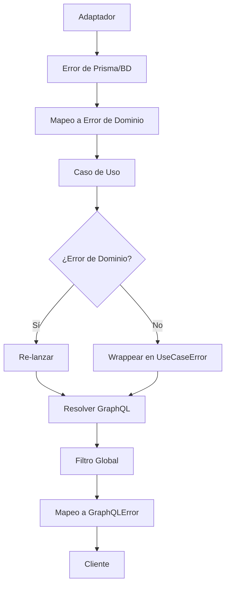

# Implementación del Filtro Global de Excepciones GraphQL

## ✅ Archivos Creados/Modificados

### 1. **Clases de Error de Dominio** (`src/shared/domain/errors/`)

- **`base.error.ts`**: Clases base de errores de dominio
  - `DomainError` (abstracta)
  - `ConflictError` (409)
  - `NotFoundError` (404)
  - `ValidationError` (400)
  - `BusinessRuleError` (422)
  - `ForbiddenError` (403)
  - `UnauthorizedError` (401)

- **`application.error.ts`**: Errores de la capa de aplicación
  - `ApplicationError` (abstracta)
  - `UseCaseError` (para fallos de casos de uso)
  - `TransformationError` (para fallos de transformación)

- **`infrastructure.error.ts`**: Errores de la capa de infraestructura
  - `InfrastructureError` (abstracta)
  - `DatabaseError` (para errores de BD)
  - `ExternalServiceError` (para servicios externos)
  - `NetworkError` (para errores de red)
  - `CacheError` (para errores de caché)

### 2. **Filtro Global de Excepciones**

- **`src/shared/infrastructure/filters/graphql-exception.filter.ts`**
  - Manejo centralizado de errores para GraphQL
  - Mapeo de errores de dominio a errores GraphQL
  - Logging estructurado con contexto apropiado
  - Manejo de errores de validación de NestJS

### 3. **Configuración Global**

- **`src/app.module.ts`**
  - Registro del filtro global usando `APP_FILTER`
  - Importación de las clases de error compartidas

### 4. **Adaptador Actualizado**

- **`src/modules/user/infrastructure/adapters/user-prisma.adapter.ts`**
  - Uso de las nuevas clases de error de dominio
  - Mapeo de errores de Prisma a errores de dominio apropiados

### 5. **Caso de Uso Actualizado**

- **`src/modules/user/application/use-cases/create-user.use-case.ts`**
  - Uso de errores de dominio específicos (`ConflictError`, `UseCaseError`)
  - Logging estructurado con contexto relevante

## 🎯 **Beneficios de la Implementación**

### **1. Separación de Responsabilidades**

- **Adaptadores**: Manejan errores específicos de infraestructura
- **Casos de Uso**: Manejan lógica de negocio y validaciones
- **Resolvers**: Permanecen delgados, solo propagan errores
- **Filtro Global**: Manejo centralizado y consistente

### **2. Consistencia**

- Misma estructura de errores en toda la aplicación
- Códigos de estado HTTP y GraphQL consistentes
- Logging estructurado uniforme

### **3. Mantenibilidad**

- Cambios centralizados en lugar de distribuidos
- Fácil agregar nuevos tipos de errores
- Código más limpio y legible

### **4. Observabilidad**

- Logging estructurado con contexto apropiado
- Trazabilidad completa de errores
- Diferentes niveles de severidad según el tipo de error

## 🔄 **Flujo de Manejo de Errores**



## 🧪 **Tipos de Error por Capa**

### **Infraestructura** → Dominio

```typescript
PrismaClientKnownRequestError (P2002) → ConflictError
PrismaClientKnownRequestError (P2025) → NotFoundError
PrismaClientValidationError → DatabaseError
```

### **Aplicación** → Dominio

```typescript
Validación de negocio → ConflictError
Fallo de caso de uso → UseCaseError
Error no controlado → UseCaseError
```

### **GraphQL** → Cliente

```typescript
DomainError → GraphQLError con código específico
ApplicationError → GraphQLError genérico de aplicación
InfrastructureError → GraphQLError de servicio no disponible
```

## 📝 **Ejemplo de Uso**

```typescript
// En el adaptador
throw new ConflictError('User already exists', error, { email: 'test@test.com' });

// En el caso de uso
throw new UseCaseError('Failed to create user', error);

// El filtro global convierte automáticamente a:
// GraphQLError con extensiones apropiadas
```

## ⚡ **Estado del Proyecto**

- ✅ Compilación exitosa
- ✅ Todas las dependencias resueltas
- ✅ Filtro global registrado
- ✅ Errores de dominio implementados
- ✅ Adaptadores actualizados
- ✅ Casos de uso actualizados

La implementación sigue las mejores prácticas de arquitectura hexagonal y proporciona un sistema robusto y escalable para el manejo de errores en aplicaciones NestJS con GraphQL.
